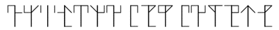
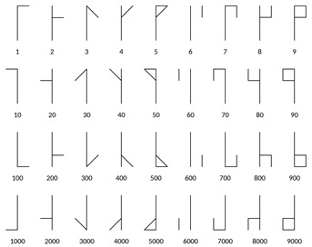
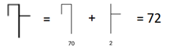

**Challenge Description:**&quot;I found the following message in a temple, I had the sensation that they were hiding something. Could you help me discover what it was?&quot;

Downloading the archive and unzipping gives the Scroll.png seen below.



In the book &quot;The Ciphers of the Monks: A Forgotten Number-notation of the Middle Ages&quot; by David A. King, the author describes the Cistercian numeral system which looks like the cypher in Scroll.png.



We can break the cypher by combining symbols from the Cisterian numeral system seen above to create the symbols from our Scroll.png file. This means each symbol represents a numeric value.



Continue this conversion for each symbol. Since ASCII uses decimal values to represent human readable symbols, we can write a script to convert the message.

```python
#!/usr/bin/python3

message = "72 84 66 123 77 48 78 107 115 95 107 78 51 119 33 125"
for value in message.split(" "):
  print(char(int(value)), end="")
print("")
```

Running this script prints out the original decimal values we decoded, followed by the flag!

```HTB{M0Nks_kN3w!}```
